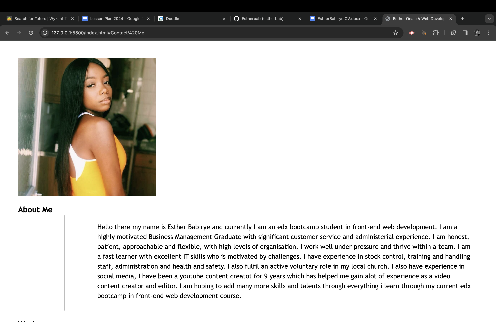
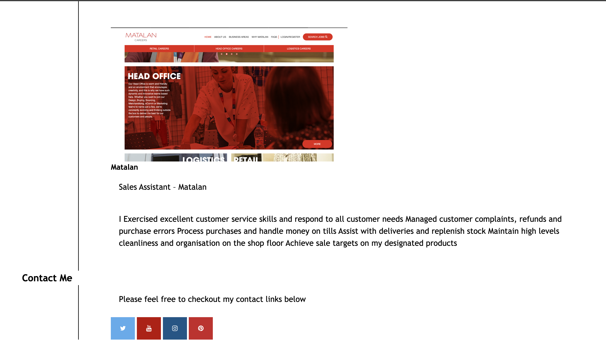
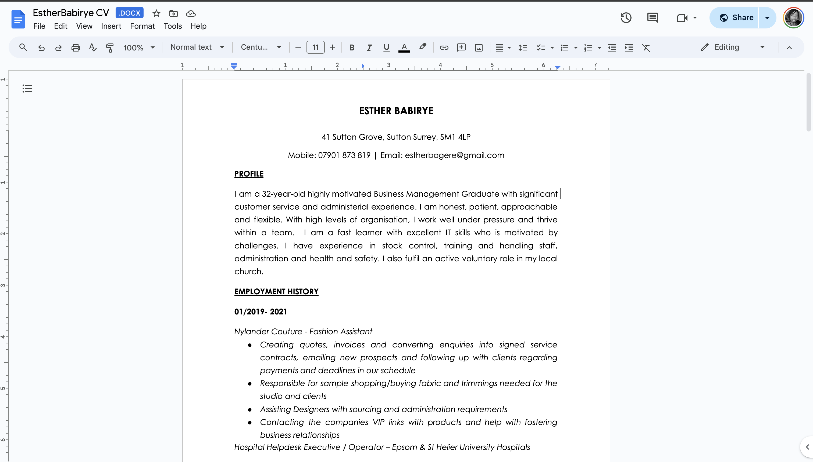

# Esther Babirye Front End Development Portfolio
A portfolio of Esther Babirye's skills &amp; talents in front-end web development 

## Description
My name is Esther Babirye and I am currently an edx skills bootcamp student learning front-end web development.

This portfolio is a look into work i have created using flexbox, CSS grid, media queries and CSS variables.

I have built a live web application to showcase the skills and talents I have learnt and implemented so far.

I am also showcasing my previous work in the work section of all the jobs i have previosly done and the skills i have gained

Live link to deployed application [link to deployed application]().

---

## Table of Contents 

* [About](#about)
* [Work](#work)
* [Contact](#contact)
* [Resume](#resume)
* [Usage](#usage)
* [Technologies](#technologies)
* [Credits](#credits)
* [License](#license)

## About
In this section you can find a brief summary about me and my job experience 

---

## Work

In this section displays all my previous jobs and work i have done and all the experince i have gained

---

## Contact

This section shows all my contact links to my socials

## Resume

In this section you can see my resume at the top in the Navbar, when you click on it, it takes you directly to my resume

## Credits

* Esther Babirye

## License
MIT License

Copyright (c) 2024 estherbab

Permission is hereby granted, free of charge, to any person obtaining a copy
of this software and associated documentation files (the "Software"), to deal
in the Software without restriction, including without limitation the rights
to use, copy, modify, merge, publish, distribute, sublicense, and/or sell
copies of the Software, and to permit persons to whom the Software is
furnished to do so, subject to the following conditions:

The above copyright notice and this permission notice shall be included in all
copies or substantial portions of the Software.

THE SOFTWARE IS PROVIDED "AS IS", WITHOUT WARRANTY OF ANY KIND, EXPRESS OR
IMPLIED, INCLUDING BUT NOT LIMITED TO THE WARRANTIES OF MERCHANTABILITY,
FITNESS FOR A PARTICULAR PURPOSE AND NONINFRINGEMENT. IN NO EVENT SHALL THE
AUTHORS OR COPYRIGHT HOLDERS BE LIABLE FOR ANY CLAIM, DAMAGES OR OTHER
LIABILITY, WHETHER IN AN ACTION OF CONTRACT, TORT OR OTHERWISE, ARISING FROM,
OUT OF OR IN CONNECTION WITH THE SOFTWARE OR THE USE OR OTHER DEALINGS IN THE
SOFTWARE.

---

---

© 2023 edX Boot Camps LLC. Confidential and Proprietary. All Rights Reserved.

